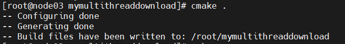
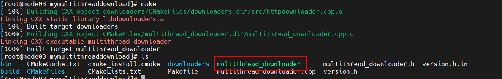
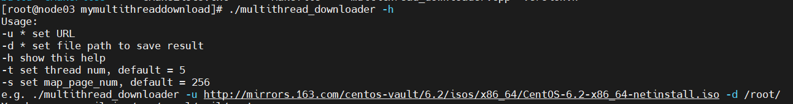

## 0、About Me

This  is a project about downloading a file by multi-connection with the HTTP server, it can help you download a file faster.

## 1、How to  compile?

firstly, you should make sure you have installed libcurl and g++ in you linux compile system;

then, enter the code home folder and exec : `cmake.`,just like this:

now， exec `make` and you will get the bin file:

## 2、how to use?

